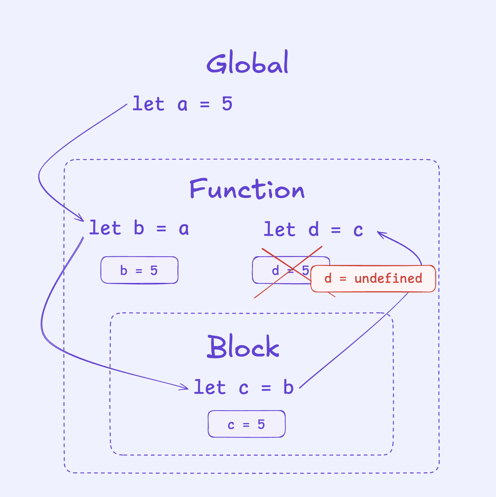

<!-- _class: cover -->

# Javascript

Dynamisez vos pages web

---

<!-- _class: two-cols-list -->

## Ce que vous nous allons voir

1. Qu'est-ce que JavaScript ?
2. Comment utiliser JavaScript ?
3. Bonnes pratiques
4. Les variables
5. Les conditions
6. Les boucles
7. Les fonctions
8. La manipulation du DOM
9. Les écouteurs d'événements
10. Conclusion & ressources

---

## Avant propos : Mise en garde avec l'IA et le code

### L'IA est un outil puissant, mais il faut l'utiliser avec précaution.

- L'IA peut générer du code, mais **il faut le vérifier**.
- L'IA peut faire des erreurs, alors **il faut les corriger**.
- L'IA peut avoir des idées, mais ... sont elles de bonnes idées ?
- L'IA peut **se perdre** ... L'IA peut **vous perdre aussi**.

> ⚠️ Commencer votre apprentissage avec l'IA n'est pas une bonne idée. Elle ne vous apprendra pas penser comme un développeur. Parce qu'un developpeur ne se contente pas d'écrire du code...
> **Le développeur résout avant tout des problèmes et le code n'est que son outil.**

---

### Suggestions pour utiliser l'IA dans votre apprentissage

- **Demander des explications** sur un concept que vous ne comprenez pas
- **Faire réviser votre code** après l'avoir écrit pour obtenir des suggestions d'amélioration
- **Explorer différentes approches** pour un même problème que vous maîtrisez déjà
- **Obtenir des conseils sur les bonnes pratiques** de développement
- **Générer des jeux de données** pour tester vos fonctions

---

### Exemple concret

Au lieu de demander :

> "Comment créer une fonction qui calcule la moyenne d'un tableau ?"

Préférez d'abord essayer par vous-même, puis demandez :

> "J'ai écrit cette fonction qui calcule la moyenne d'un tableau. Peux-tu suggérer des améliorations au niveau de la performance ou de la lisibilité ?"

---

<!-- _class: cover -->

# Javascript c'est quoi ?

Quelques notions de base sur le langage Javascript

---

## Le seul langage de script côté navigateur

Javascript est le seul langage de script côté navigateur.
Il est interprété par le moteur Javascript du navigateur.

---

### Il est utilisé pour :

- rendre les pages web interactives.
- manipuler le DOM (Document Object Model).
- faire des requêtes HTTP (AJAX).
- ...

---

## Un langage, plusieurs environnements

Javascript peut être exécuté dans différents environnements :

- Navigateur : pour les applications web
- Serveur : avec Node.js
- Bureau : avec Electron
- Mobile : avec React Native et Cordova
- IoT : avec Johnny-Five
- Réalité virtuelle : avec A-Frame

---

## JavaScript n'est pas Java 🤫

Même s'il contient le préfixe "Java", les langages Java et JavaScript n'ont rien en commun et ce nom a été choisi pour des raison marketing.

- **Java** : langage compilé, orienté objet, utilisé pour les applications d'entreprise, les applications Android et les applications de bureau.
- **JavaScript** (dit **JS**) : langage interprété, orienté prototype\*, utilisé pour le développement web et les applications mobiles.

> \*Contrairement aux langages orientés objet classiques qui utilisent des classes, JavaScript utilise des objets comme modèles pour créer d'autres objets.

---

## JavaScript et EcmaScript

Javascript est une implémentation du standard EcmaScript (ES).

- **ECMA** : Organisme qui définit le standard
- **ECMAScript** : Le standard officiel du langage
- **JavaScript** : L'implémentation la plus connue du standard ECMAScript
- **Versions** :
  - ES5 : Version publiée en 2009
  - ES6/ES2015 : Version majeure publiée en 2015 (d'où la double appellation)
  - Au-delà de ES2015, le nom de la version est l'année de publication
  - ES2020 : Version publiée en 2020

---

<!-- _class: cover -->

# Comment utiliser JavaScript dans le navigateur ?

---

## Intégration de JavaScript dans une page web

Il existe plusieurs façons d'intégrer JavaScript dans une page web :

- **Inline** : en utilisant l'attribut `onclick` ou `onload` dans une balise HTML.

```html
<button onclick="alert('Bonjour !')">Cliquez ici</button>
```

- **Dans une balise `<script>`** : en plaçant le code JavaScript directement dans une balise `<script>` dans le fichier HTML.

```html
<script>
  alert("Bonjour !");
</script>
```

---

## Dans un fichier externe

Il est également possible de placer le code JavaScript dans un fichier externe avec l'extension `.js` et de l'inclure dans le fichier HTML à l'aide de la balise `<script>`.

```html
<!DOCTYPE html>
<head></head>
<body>
  ...
  <!-- Inclusion du fichier JavaScript externe -->
  <script src="script.js"></script>
</body>
```

```javascript
// script.js
alert("Bonjour !");
```

---

## Nous vous conseillons d'utiliser un fichier externe

Cela présente plusieurs avantages :

- **séparer** le code HTML et JavaScript pour une meilleure lisibilité.
- **faciliter** la maintenance du code.
- **réutiliser** du code JavaScript sur plusieurs pages ou projets.
- ... et surtout, c'est la pratique recommandée par les standards du web.

---

<!-- _class: cover -->

# Bonnes pratiques

---

## Convention de nommage

- Utiliser des **noms explicites et significatifs**.
  > `let nombreUtilisateurs` plutot que `let nbU`.
- Utiliser le **camelCase** pour les variables et les fonctions.
  > `let nombreUtilisateurs` et `function calculerMoyenne()`.
- Privilégier l'anglais qui est la langue de la programmation
  > `let userCount` et `function calculateAverage()`.

---

## Commentaires et documentation

- Utiliser des commentaires pour expliquer le code complexe.
- Utiliser des outils de documentation comme JSDoc pour générer la documentation automatiquement :

```javascript
/**
 * Calculate average age.
 *
 * @param {Array} students - The array of student objects
 * @return {Number} The average age of the students
 */
function calculateAverageAge(students) {...}
```

> ⚠️ Éviter les commentaires inutiles et redondants.

---

## Structure de code

- Utiliser une indentation cohérente pour améliorer la lisibilité.
- Utiliser des espaces pour séparer les opérateurs et les parenthèses.
- Utiliser des lignes de séparation pour séparer les sections de code.
  > Et bien évidemment **Git** pour suivre les modifications du code.

---

<!-- _class: exercise -->

# Exercice : Ajoutez votre premier code JavaScript

1. Créez un fichier HTML
2. Créez un fichier JavaScript
3. Incluez le fichier JavaScript dans le fichier HTML
4. Dans le fichier JavaScript, écrivez un console.log qui affiche "Bonjour, monde !"

```javascript
console.log("Bonjour, monde !");
```

5. Ouvrez le fichier HTML dans votre navigateur et ouvrez la console (F12)

---

<!-- _class: separator -->

# C'est bon, ? Et bien commençons les choses sérieuses ... 😊

---

<!-- _class: cover -->

# Les variables

let, const et var

---

## Qu'est-ce qu'une variable ?

Une variable est un conteneur qui permet de stocker une valeur.
Elle est définie par un nom et peut contenir différents types de données.

---

## Déclaration d'une variable

Il existe trois façons de déclarer une variable en JavaScript :

- `var` : portée fonctionnelle (plus utilisé, déconseillé)
- `let` : portée de bloc (recommandé)
- `const` : portée de bloc, valeur constante (recommandé)

---

## Portée des variables

La portée d'une variable détermine où elle peut être utilisée dans le code.

- **Portée globale** :
  La variable est accessible dans tout le code.
- **Portée locale** :
  La variable est accessible uniquement dans la fonction ou le bloc où elle a été déclarée.



---

### Exemple par le code

```javascript
const nom = "John"; // portée globale
console.log(nom); // accessible

function afficherNom() {
  const nomLocal = "Doe"; // portée locale
  console.log(nom); // accessible
  console.log(nomLocal); // accessible
}

afficherNom();
console.log(nomLocal); // erreur : nomLocal n'est pas défini
```

---

## Types de données

JavaScript est un langage faiblement typé, ce qui signifie que vous n'avez pas besoin de déclarer le type de la variable lors de sa déclaration.

- **String** : Chaîne de caractères (ex: "Bonjour")
- **Number** : Nombre (ex: 25)
- **Boolean** : Valeur booléenne (true ou false)
- **Object** : Objet (ex: { nom: "John", age: 25 })
- **Array** : Tableau (ex: [1, 2, 3])
- **Function** : Fonction (ex: function() {})
- **Undefined** : Valeur non définie (ex: let x;)
- **Null** : Valeur nulle (ex: let x = null)

---

### Quel est le type de la variable `nom` ?

On peut aussi utiliser le mot clé **typeof** pour connaître le type d'une variable.

```javascript
console.log(typeof nom); // "string"
```

---

## Exemple d'utilisation des variables

```javascript
let fruit = "Banane";

let personne = {
  nom: "John",
  age: 25,
  estActif: true,
};

let addition = function (a, b) {
  return a + b;
};
```

---

<!-- _class: exercise -->

## Exercice

1. Créez une variable `nom` et assignez-lui votre nom.
2. Créez une variable `age` et assignez-lui votre âge.
3. Affichez dans la console un message de bienvenue avec les variables `nom` et `age`.

```javascript
console.log("Bonjour, je m'appelle " + nom + "et j'ai " + age + " ans.");
```

---

<!-- _class: cover -->

# Les conditions

if / if else / else

---

## Qu'est-ce qu'une condition ?

Une condition est une instruction qui permet d'exécuter un bloc de code si une condition est vraie (ou son contraire).
Elle est utilisée pour prendre des décisions dans le code.

---

## Structure d'une condition

La structure d'une condition est la suivante :

```javascript
if (condition) {
  // bloc de code à exécuter si la condition est vraie
}
```

on peut aussi ajouter une condition alternative :

```javascript
if (condition) {
  // bloc de code à exécuter si la condition est vraie
} else {
  // bloc de code à exécuter si la condition est fausse
}
```

---

on peut aussi ajouter plusieurs conditions :

```javascript
if (condition1) {
  // bloc de code à exécuter si la condition1 est vraie
} else if (condition2) {
  // bloc de code à exécuter si la condition2 est vraie
} else if (condition3) {
  // bloc de code à exécuter si la condition3 est vraie
} else {
  // bloc de code à exécuter si aucune des conditions n'est vraie
}
```

---

On peut aussi imbriquer des conditions :

```javascript
if (condition1) {
  if (condition2) {
    // bloc de code à exécuter si condition1 et condition2 sont vraies
  } else {
    // bloc de code à exécuter si condition1 est vraie et condition2 est fausse
  }
} else {
  // bloc de code à exécuter si condition1 est fausse
}
```

> ⚠️ Attention à ne pas trop imbriquer les conditions, cela peut rendre le code difficile à lire et à comprendre.

---

### Exemple d'une condition liée à l'âge

```javascript
let age = 18;

if (age >= 18) {
  console.log("Vous êtes majeur.");
} else {
  console.log("Vous êtes mineur.");
}
```

> 💬 Ici, qu'est ce qui s'affiche dans la console ?

---

<!-- _class: cover -->

# Les operateurs

---

<!-- _class: two-cols-list -->

## Les opérateurs de comparaison

Les opérateurs de comparaison permettent de comparer deux valeurs et de retourner un booléen (true ou false).

- `==` : égal à
- `===` : strictement égal à
- `!=` : différent de
- `!==` : strictement différent de
- `>` : supérieur à
- `<` : inférieur à
- `>=` : supérieur ou égal à
- `<=` : inférieur ou égal à

---

## Les opérateurs logiques

Les opérateurs logiques permettent de combiner plusieurs conditions.

- `&&` : ET logique
- `||` : OU logique
- `!` : NON logique

---

<!-- _class: two-cols-list -->

Les opérateurs logiques sont utilisés pour combiner plusieurs conditions. Ils peuvent renvoyer un booléen (true ou false) en fonction des conditions.

- les retours pour **&&**
  - `true && true; // true`
  - `true && false; // false`
  - `false && true; // false`
  - `false && false; // false`
- les retours pour **||**
  - `true || true; // true`
  - `true || false; // true`
  - `false || true; // true`
  - `false || false; // false`

---

## L'opérateur ternaire

L'opérateur ternaire permet d'écrire une condition sur une seule ligne.  
Syntaxe : `condition ? valeurSiVrai : valeurSiFaux`

Exemple :

```javascript
let age = 18;

let message = age >= 18 ? "Vous êtes majeur." : "Vous êtes mineur.";
```

---

## Les opérateurs de coalescence nulle

Ces opérateurs permettent de gérer les valeurs nulles ou indéfinies.

- `??` : retourne la première valeur qui n'est ni `null` ni `undefined`
- `??=` : assigne une valeur uniquement si la variable est `null` ou `undefined`

Exemples :

```javascript
let nom = null;

let nomAffiche = nom ?? "Anonyme"; // "Anonyme"

let prenom;
prenom ??= "Invité";
console.log(prenom); // "Invité"
```

---

## L'opérateur ternaire

L'opérateur ternaire est une façon concise d'écrire une condition.
C'est ce que vous retrouverez souvent dans les codebases modernes.

```javascript
let age = 18;
let message = age >= 18 ? "Vous êtes majeur." : "Vous êtes mineur.";
```

---

<!-- _class: exercise -->

## Exercice

Vérifiez si une personne à le droit de conduire en fonction de son âge et de son pays (France ou Canada).

Sachant que :

- l'âge minimum pour conduire en France est de 18 ans.
- l'âge minimum pour conduire au Canada est de 16 ans.

---

<!-- _class: exercise -->

## Corrigé

```javascript
let age = 18;
let pays = "France";

// Vérification du droit de conduire
if ((pays === "France" && age >= 18) || (pays === "Canada" && age >= 16)) {
  console.log("Vous avez le droit de conduire.");
} else {
  console.log("Vous n'avez pas le droit de conduire.");
}
```

---

## Les tableaux

Un `Array` est une structure de données qui permet de **stocker plusieurs valeurs dans une seule variable**.
Il est déclaré avec des crochets `[]` et les valeurs sont séparées par des virgules.

```javascript
let fruits = ["Pomme", "Banane", "Orange"];
```

On peut accéder à un élément d'un tableau en utilisant son index (position) :

```javascript
console.log(fruits[0]); // "Pomme"
```

---

## Les objets

Un `Object` est une structure de données qui permet de **stocker des paires clé-valeur**.
Il est déclaré avec des accolades `{}` et les paires clé-valeur sont séparées par des virgules.

```javascript
let personne = {
  nom: "John",
  age: 25,
  estActif: true,
};
```

---

On peut accéder à une valeur d'un objet en utilisant sa clé :

```javascript
console.log(personne.nom); // "John"
```

ou dans le cas d'une clé dynamique :

```javascript
console.log(personne["age"]); // 25
```

---

<!-- _class: cover -->

# Les boucles

for, while, do...while

---

## Qu'est-ce qu'une boucle ?

Une boucle est une structure de contrôle qui permet d'exécuter un bloc de code plusieurs fois.
Elle est utilisée pour itérer sur des collections de données ou pour exécuter un code un certain nombre de fois.

---

## Les types de boucles

Il existe plusieurs types de boucles en JavaScript.

Elles sont utilisées pour **itérer sur des collections de données** ou pour **exécuter un code un certain nombre de fois** et chaque type de boucle a ses propres caractéristiques et utilisations.

🔗 [Consultez le MDN](https://developer.mozilla.org/fr/docs/Web/JavaScript/Guide/Loops_and_iteration)

---

### Boucle `for`

La boucle `for` est utilisée pour itérer sur une séquence de valeurs.

```javascript
for (let i = 0; i < 5; i++) {
  console.log(i);
}
```

---

### Boucle `while`

La boucle `while` exécute un bloc de code tant qu'une condition est vraie.

```javascript
let i = 0;
while (i < 5) {
  console.log(i);
  i++;
}
```

---

### Boucle `do...while`

La boucle `do...while` garantit que le bloc de code sera exécuté au moins une fois.

```javascript
let i = 0;
do {
  console.log(i);
  i++;
} while (i < 5);
```

---

### La boucle `for...of` pour les itérables (tableaux, strings)

La boucle `for...of` permet d'itérer sur les éléments d'un tableau ou d'une chaîne de caractères.

```javascript
let fruits = ["Pomme", "Banane", "Orange"];

for (let fruit of fruits) {
  console.log(fruit);
}
```

---

### La boucle `for...in`

La boucle `for...in` permet d'itérer sur les propriétés d'un objet.

```javascript
let personne = {
  nom: "John",
  age: 25,
};
for (let propriete in personne) {
  console.log(propriete + ": " + personne[propriete]);
}
```

---

<!-- _class: separator -->

## ...et des méthodes ...

## WTF ?! 🤯

---

### La méthode `forEach`

La méthode `forEach` permet d'itérer sur les éléments d'un tableau.

```javascript
let fruits = ["Pomme", "Banane", "Orange"];

fruits.forEach(function (fruit) {
  console.log(fruit);
});
```

> ⚠️ La méthode `forEach` est une méthode d'itération pour les tableaux et ne peut pas être utilisée sur des objets.

---

### La boucle `map`

La méthode `map` permet de créer un nouveau tableau en appliquant une fonction à chaque élément d'un tableau.

```javascript
let nombres = [1, 2, 3, 4, 5];

let carrés = nombres.map(function (nombre) {
  return nombre * nombre;
});
console.log(carrés); // [1, 4, 9, 16, 25]
```

> 💡 Elle ne modifie pas le tableau d'origine.

---

## ...et bien d'autres méthodes 😵‍💫

- `filter` : permet de filtrer les éléments d'un tableau en fonction d'une condition.
- `some` : permet de vérifier si au moins un élément d'un tableau satisfait une condition.
- `every` : permet de vérifier si tous les éléments d'un tableau satisfont une condition.
- `find` : permet de trouver le premier élément d'un tableau qui satisfait une condition.
- `includes` : permet de vérifier si un tableau contient un élément spécifique.
- ...
  🔗 [Consultez le MDN](https://developer.mozilla.org/fr/docs/Web/JavaScript/Reference/Global_Objects/Array) pour les méthodes des tableaux

---

<!-- _class: exercise -->

## Exercice

1. Créez un tableau de nombres
2. Créez une variable `somme` initialisée à 0
3. Bouclez sur le tableau et ajouter chaque nombre à la variable `somme`
4. Affichez la somme dans la console

---

<!-- _class: exercise -->

## Corrigé

```javascript
let nombres = [1, 2, 3, 4, 5];
let somme = 0;

for (let i = 0; i < nombres.length; i++) {
  somme += nombres[i];
}

console.log(somme); // 15
```

---

<!-- _class: cover -->

# Les fonctions

function, return, params

---

## Qu'est-ce qu'une fonction ?

Une fonction est un bloc de code qui peut être exécuté lorsqu'il est appelé.
Elle peut prendre des paramètres et retourner une valeur.
Elle est utilisée pour encapsuler une logique réutilisable et éviter la répétition de code.

> Les fonctions sont l'un des concepts les plus importants en programmation.

---

## Déclaration d'une fonction

Il existe plusieurs façons de déclarer une fonction en JavaScript :

- **Fonction déclarée** : `function nomDeLaFonction(params) { ... }`
- **Fonction anonyme** : `const nomDeLaFonction = function(params) { ... }`
- **Fonction fléchée** : `const nomDeLaFonction = (params) => { ... }`
- **Fonction de rappel (callback)** : `function nomDeLaFonction(params, cb) { ... cb(valeur); }`
- ...
  🔗 [Consultez le MDN](https://developer.mozilla.org/fr/docs/Web/JavaScript/Guide/Fonctions) pour plus de détails. _(soyez un peu curieux 😉)_

---

## Exemple d'une fonction

```javascript
function addition(a, b) {
  return a + b;
}
console.log(addition(2, 3)); // 5
```

Ici, la fonction `addition` prend deux paramètres `a` et `b` et retourne le résultat de l'addition. De manière générale, on dit qu'une fonction prend des **arguments** et retourne une **valeur**.

---

<!-- _class: exercise -->

## Exercice

Reprenez l'exercice précédent et créez une fonction `verifierDroitDeConduire` qui prend en paramètres l'âge et le pays de la personne.
La fonction doit retourner un message indiquant si la personne a le droit de conduire ou non.

```javascript
function verifierDroitDeConduire(age, pays) {
  // ...
}
```

---

<!-- _class: exercise -->

## Corrigé

Voici une solution possible :

```javascript
function verifierDroitDeConduire(age, pays) {
  if (age >= 18 && pays === "France") {
    return "Vous avez le droit de conduire.";
  } else if (age >= 16 && pays === "Canada") {
    return "Vous avez le droit de conduire.";
  } else {
    return "Vous n'avez pas le droit de conduire.";
  }
}
```

---

<!-- _class: exercise -->

Autre solution possible :

```javascript
function verifierDroitDeConduire(age, pays) {
  let droitDeConduire = false;

  if (pays === "France" && age >= 18) {
    droitDeConduire = true;
  } else if (pays === "Canada" && age >= 16) {
    droitDeConduire = true;
  }

  return droitDeConduire
    ? "Vous avez le droit de conduire."
    : "Vous n'avez pas le droit de conduire.";
}
```

---

<!-- _class: cover -->

# Manipulation du DOM

querySelector, createElement, textContent, ...

---

## Qu'est-ce que le DOM ?

Le DOM (Document Object Model) est une représentation en mémoire de la structure d'un document HTML. Nous pouvons le manipuler avec JavaScript pour modifier le contenu, la structure et le style d'une page web.

---

## Manipulation du DOM

Le DOM est une interface de programmation qui permet d'accéder et de manipuler le contenu d'une page web. Voici quelques méthodes courantes :

- `querySelector` : permet de sélectionner un élément du DOM.
- `createElement` : permet de créer un nouvel élément HTML.
- `textContent` : permet de modifier le texte d'un élément.
- `appendChild` : permet d'ajouter un élément enfant à un élément parent.
- `removeChild` : permet de supprimer un élément enfant d'un élément parent.
- `setAttribute` : permet de modifier un attribut d'un élément.

---

## Exemple de manipulation du DOM

### Créer un nouvel élément

```javascript
// Créer un nouvel élément
let nouveauParagraphe = document.createElement("p");

// Ajouter du texte à l'élément
nouveauParagraphe.textContent = "Ceci est un nouveau paragraphe.";

// Ajouter l'élément au DOM
document.body.appendChild(nouveauParagraphe);
```

---

### Modifier le contenu d'un élément

```javascript
// Sélectionner un élément du DOM
let titre = document.querySelector("h1");

// Modifier le texte de l'élément
titre.textContent = "Bonjour, monde !";
```

---

### Créer un nouvel élément et l'ajouter au DOM

```javascript
// Créer un nouvel élément
let nouveauParagraphe = document.createElement("p");

// Ajouter du texte à l'élément
nouveauParagraphe.textContent = "Ceci est un nouveau paragraphe.";

// Ajouter l'élément au DOM
document.body.appendChild(nouveauParagraphe);
```

---

### Supprimer un élément du DOM

```javascript
// Sélectionner l'élément à supprimer
let paragrapheASupprimer = document.querySelector("p");

// Supprimer l'élément du DOM
paragrapheASupprimer.parentNode.removeChild(paragrapheASupprimer);
```

---

## Ajouter une classe à un élément

C'est souvent utilisé pour appliquer des styles CSS à un élément en réponse à une action de l'utilisateur.

- `classList.add()` : ajoute une classe à un élément.
- `classList.remove()` : supprime une classe d'un élément.
- `classList.toggle()` : ajoute ou supprime une classe en fonction de sa présence.

---

```html
<h1>Bonjour, monde !</h1>
```

on peut ajouter une classe à l'élément `h1` en utilisant la méthode `classList.add()` :

```javascript
// Sélectionner un élément du DOM
let titre = document.querySelector("h1");

// Ajouter une classe à l'élément
titre.classList.add("ma-classe");
```

ce qui va ajouter la classe `ma-classe` à l'élément `h1`.

```html
<h1 class="ma-classe">Bonjour, monde !</h1>
```

---

<!-- _class: cover -->

# Écouteurs d'événements

addEventListener, removeEventListener, ...

---

## Qu'est-ce qu'un écouteur d'événement ?

Un écouteur d'événement est une fonction qui attend qu'un événement se produise sur un élément du DOM. Il permet de réagir à des actions de l'utilisateur, comme un clic, un survol, une saisie au clavier, etc.

- Il est utilisé pour rendre les pages web interactives et dynamiques.
- Il est souvent utilisé en combinaison avec la manipulation du DOM pour créer des applications web interactives.

---

## Ajouter un écouteur d'événement

Pour ajouter un écouteur d'événement à un élément, on utilise la méthode `addEventListener()`.

```javascript
// Sélectionner un élément du DOM
let bouton = document.querySelector("button");

// Ajouter un écouteur d'événement
bouton.addEventListener("click", function () {
  alert("Bouton cliqué !");
});
```

---

## Supprimer un écouteur d'événement

Pour supprimer un écouteur d'événement, on utilise la méthode `removeEventListener()`.

```javascript
// Définir la fonction de l'écouteur d'événement
function afficherAlerte() {
  alert("Bouton cliqué !");
}

// Ajouter un écouteur d'événement sur le bouton précédent créé
bouton.addEventListener("click", afficherAlerte);

// Supprimer l'écouteur d'événement (après l'avoir ajouté)
bouton.removeEventListener("click", afficherAlerte);
```

---

- Lorsque l'on crée un écouteur d'événement, il est important de s'assurer que la fonction utilisée est bien définie et accessible au moment de l'ajout de l'écouteur.
- Il est important de noter que pour supprimer un écouteur d'événement, il faut passer la même fonction que celle utilisée lors de l'ajout de l'écouteur.
  > ⚠️ Ne pas oublier de supprimer les écouteurs d'événements lorsque vous n'en avez plus besoin, afin d'éviter les fuites de mémoire et d'améliorer les performances de votre application.

---

## Événements courants

Voici quelques événements courants que vous pouvez utiliser :

- `click` : lorsque l'utilisateur clique sur un élément.
- `mouseover` : lorsque l'utilisateur survole un élément.
- `mouseout` : lorsque l'utilisateur quitte un élément.
- `keydown` : lorsque l'utilisateur appuie sur une touche du clavier.
- `submit` : lorsque l'utilisateur soumet un formulaire.
- `input` : lorsque l'utilisateur saisit du texte dans un champ de formulaire.
- ...

🔗 [Consultez le MDN](https://developer.mozilla.org/fr/docs/Web/Events) pour plus de détails sur les écouteurs d'événement.

---

## Exemple d'écouteur d'événement

```javascript
// Sélectionner un élément du DOM
let bouton = document.querySelector("button");
let titre = document.querySelector("h1");
let compteur = 0;

// Ajouter un écouteur d'événement
bouton.addEventListener("click", function () {
  compteur++;
  titre.textContent = "Vous avez cliqué " + compteur + " fois.";
});
```

---

<!-- _class: exercise -->

## Exercice

1. Créez une page web avec un titre et un bouton.
2. Lorsque l'utilisateur clique sur le bouton, le titre doit changer de couleur et de texte.
3. Utilisez la méthode `querySelector` pour sélectionner le titre et le bouton.
4. Utilisez la méthode `textContent` pour modifier le texte du titre.
5. Utilisez la méthode `style` pour modifier la couleur du titre.

---

<!-- _class: exercise -->

## Corrigé

```javascript
// Sélectionner le titre et le bouton
let titre = document.querySelector("h1");
let bouton = document.querySelector("button");

// Ajouter un écouteur d'événement au bouton
bouton.addEventListener("click", function () {
  // Modifier le texte et la couleur du titre
  titre.textContent = "Titre modifié";
  titre.style.color = "red";
});
```

---

<!-- _class: cover -->

# Conclusion

---

- JavaScript est un langage de programmation essentiel pour le développement web.
- Il permet de rendre les pages web interactives et dynamiques.
- Il est important de suivre les bonnes pratiques de développement pour écrire du code lisible et maintenable.
- La manipulation du DOM et les écouteurs d'événements sont des concepts clés pour créer des applications web interactives.

---

> N'oubliez pas que l'apprentissage du JavaScript, comme tout langage, est un processus continu qui se fait par la pratique.
> Le langage évolue constamment avec de nouvelles fonctionnalités et pratiques alors, continuez à **pratiquer et explorer** pour approfondir vos compétences.

---

<!-- _class: cover -->

# Merci de votre attention 🫶 !

---

## Ressources

- [MDN Web Docs - JavaScript](https://developer.mozilla.org/fr/docs/Web/JavaScript)
- [Grafikart - JavaScript](https://grafikart.fr/formations/formation-javascript)
- [Eloquent JavaScript](https://eloquentjavascript.net/)
- [You Don't Know JS](https://github.com/getify/You-Dont-Know-JS)
